#  Hi, I'm Salil Gupta

<div align="center">
  
<!-- Animated Header with Typing Effect -->


<!-- Animated Profile GIF/Banner -->


<!-- Social Media Badges with Hover Animation -->
<p>
  <a href="mailto:salilgupta2510@gmail.com">
    
  </a>
  <a href="https://linkedin.com/in/salilgupta2510">
    
  </a>
  <a href="https://github.com/salilgupta2510">
    
  </a>
  <a href="https://twitter.com/salilgupta2510">
    
  </a>
</p>

<!-- Animated Visitor Counter -->


</div>

---

##  About Me


```javascript
const salil = {
    name: "Salil Gupta",
    role: "Full Stack Developer",
    location: "India 🇮🇳",
    education: "CS @ GL Bajaj Institute",
    languages: ["JavaScript", "Python", "Java", "C++"],
    technologies: {
        frontend: ["React", "Next.js", "Vue.js", "TypeScript"],
        backend: ["Node.js", "Express", "Spring Boot", "Flask"],
        databases: ["MongoDB", "MySQL", "PostgreSQL", "Redis"],
        cloud: ["AWS", "Docker", "Kubernetes"],
        tools: ["Git", "VS Code", "Postman", "Figma"]
    },
    currentFocus: "Building scalable web applications",
    funFact: "I debug with console.log() and I'm proud of it! 😄"
};
```

- 🎓 **Computer Science Student** at GL Bajaj Institute of Technology
- 💼 **3+ years** of experience in Full Stack Development
- 🌱 Currently mastering **Advanced Cloud Technologies** & **Microservices**
- 👯 Open to collaborate on **innovative projects** and **open source**
- 💬 Ask me about **React, Node.js, Python**, or any tech stuff
- ⚡ **Fun fact:** I can code for 12+ hours straight with just coffee! ☕

---

##  Tech Arsenal

<div align="center">

### 💻 Programming Languages
<p>
  
</p>

### 🎨 Frontend Technologies
<p>
  
</p>

### ⚙️ Backend Technologies
<p>
  
</p>

### 🗄️ Databases & Cloud
<p>
  
</p>

### 🛠️ Tools & Platforms
<p>
  
</p>

</div>

---

##  GitHub Analytics

<div align="center">

<!-- GitHub Stats Cards with Animation -->


<!-- GitHub Streak Stats -->


<!-- Activity Graph -->


<!-- GitHub Trophy -->


</div>

---

##  Featured Projects

<div align="center">

<!-- Project Cards -->
<table>
<tr>
<td width="50%" valign="top">

### 🏪 E-Commerce Platform
[](https://github.com/salilgupta2510/ecommerce-platform)

**Tech Stack:** React.js, Node.js, MongoDB, Stripe
- ✅ Real-time inventory management
- ✅ Secure payment integration
- ✅ Admin dashboard with analytics
- ⭐ 50+ Stars | 🍴 25+ Forks

</td>
<td width="50%" valign="top">

### 📊 AI Task Manager
[](https://github.com/salilgupta2510/ai-task-manager)

**Tech Stack:** Next.js, TypeScript, OpenAI API
- ✅ Smart task prioritization
- ✅ Team collaboration features
- ✅ AI-powered insights
- ⭐ 35+ Stars | 🍴 15+ Forks

</td>
</tr>
<tr>
<td width="50%" valign="top">

### 🌤️ Weather Intelligence
[](https://github.com/salilgupta2510/weather-intelligence)

**Tech Stack:** Vue.js, Python Flask, ML Models
- ✅ Real-time global weather data
- ✅ Predictive analytics
- ✅ Interactive visualizations
- ⭐ 40+ Stars | 🍴 20+ Forks

</td>
<td width="50%" valign="top">

### ⛓️ Blockchain Voting
[](https://github.com/salilgupta2510/blockchain-voting)

**Tech Stack:** Solidity, Web3.js, React.js
- ✅ Secure & transparent voting
- ✅ Blockchain-based verification
- ✅ Zero fraud incidents
- ⭐ 25+ Stars | 🍴 10+ Forks

</td>
</tr>
</table>

</div>

---

##  Achievement Stats

<div align="center">

<table>
<tr>
<td align="center" width="25%">

<br><strong>5+</strong>
<br>Hackathons Won
</td>
<td align="center" width="25%">

<br><strong>25+</strong>
<br>Projects Built
</td>
<td align="center" width="25%">

<br><strong>250+</strong>
<br>GitHub Stars
</td>
<td align="center" width="25%">

<br><strong>500+</strong>
<br>Contributions
</td>
</tr>
<tr>
<td align="center" width="25%">

<br><strong>85%</strong>
<br>Academic Score
</td>
<td align="center" width="25%">

<br><strong>15+</strong>
<br>Technologies
</td>
<td align="center" width="25%">

<br><strong>50+</strong>
<br>Collaborations
</td>
<td align="center" width="25%">

<br><strong>1000+</strong>
<br>Commits
</td>
</tr>
</table>

</div>

---

##  Current Focus & Goals

<div align="center">

### 🎯 What I'm Working On

```mermaid
graph LR
    A[🔭 Microservices] --> B[☁️ Cloud Architecture]
    B --> C[🐳 Kubernetes]
    C --> D[🤖 AI Integration]
    D --> E[🌟 Open Source]
    
    style A fill:#ff6b6b
    style B fill:#4ecdc4
    style C fill:#45b7d1
    style D fill:#f093fb
    style E fill:#ffd93d
```



**🌱 Currently Learning:** Kubernetes, DevOps, System Design  
**👯 Looking to Collaborate:** Open Source Projects, Startup Ideas  
**🥅 2024 Goals:** Contribute to major OSS, Build SaaS products  
**📚 Reading:** "Designing Data-Intensive Applications"

</div>

---

##  Random Dev Quote

<div align="center">
  


</div>

---

##  Currently Coding To

<div align="center">
  
[](https://open.spotify.com/user/salilgupta2510)

</div>

---

##  Let's Connect & Build Something Amazing!

<div align="center">

### 🌟 Ready to Collaborate?

<a href="mailto:salilgupta2510@gmail.com">
  
</a>
<a href="https://linkedin.com/in/salilgupta2510">
  
</a>
<a href="https://twitter.com/salilgupta2510">
  
</a>

<!-- Resume Download -->
<br><br>
<a href="https://drive.google.com/file/d/your-resume-link">
  
</a>

<!-- Coffee Support -->
<br><br>
<a href="https://www.buymeacoffee.com/salilgupta">
  
</a>

### 💬 "Great things are built by teams. Let's build something great together!"

</div>

---

<div align="center">

<!-- Animated Footer -->


**⭐ Don't forget to star repositories you find useful!**  
**🔔 Follow me for exciting updates and new projects!**


</div>
