#  Hey there! I'm Salil Gupta

<div align="center">

<!-- Dynamic Typing Animation with Multiple Lines -->


<!-- Animated Profile Header -->


<!-- Real-time Social Stats with Dynamic Updates -->
<p>
  <a href="mailto:salilgupta2510@gmail.com">
    
  </a>
  <a href="https://linkedin.com/in/salilgupta2510">
    
  </a>
  <a href="https://github.com/salilgupta2510">
    
  </a>
  <a href="https://twitter.com/salilgupta2510">
    
  </a>
</p>

<!-- Dynamic Live Stats -->


<!-- Live Status Indicator -->
<br><br>


</div>

---

##  About Me - The Digital Architect


```typescript
interface Developer {
  name: string;
  role: string[];
  location: string;
  currentMission: string;
  lifePhilosophy: string;
}

const salilGupta: Developer = {
  name: "Salil Gupta",
  role: [
    "Full Stack Developer 🚀",
    "Problem Solver 🧩",
    "Tech Enthusiast 💡",
    "Open Source Contributor 🌟"
  ],
  location: "India 🇮🇳",
  currentMission: "Building scalable solutions that matter",
  lifePhilosophy: "Code is poetry in motion ✨"
};

// My development approach
const myApproach = {
  code: "Clean, scalable, and maintainable",
  learn: "Every day brings new knowledge",
  build: "Solutions that make a difference",
  share: "Knowledge grows when shared"
};
```

### 🎯 Quick Stats About Me
- 🎓 **Computer Science Student** at GL Bajaj Institute of Technology
- 💼 **3+ Years** of hands-on development experience
- 🌱 **Currently Mastering:** Microservices, Cloud Architecture, DevOps
- 👥 **Collaboration:** Always open to innovative projects and partnerships
- 💬 **Expertise:** React, Node.js, Python, System Design
- ⚡ **Super Power:** Turning coffee into code since 2021! ☕→💻

---

##  Tech Arsenal - My Digital Weapons

<div align="center">

### 🚀 Languages & Frameworks
<p>
  
</p>

### 🎨 Frontend Mastery
<p>
  
</p>

### ⚙️ Backend Excellence
<p>
  
</p>

### 🗄️ Database & Cloud
<p>
  
</p>

### 🛠️ DevOps & Tools
<p>
  
</p>

</div>

---

##  Live GitHub Analytics - Real-Time Updates

<div align="center">

<!-- Dynamic GitHub Stats with Real-Time Updates -->
<picture>
  <source media="(prefers-color-scheme: dark)" srcset="https://github-readme-stats-sigma-five.vercel.app/api?username=salilgupta2510&show_icons=true&theme=radical&include_all_commits=true&count_private=true&hide_border=true&bg_color=0D1117,1A1B27,2D3748&title_color=00D4FF&icon_color=FF6B6B&text_color=FFFFFF&border_radius=15&cache_seconds=86400"/>
  
</picture>

<picture>
  <source media="(prefers-color-scheme: dark)" srcset="https://github-readme-stats-sigma-five.vercel.app/api/top-langs/?username=salilgupta2510&layout=compact&langs_count=10&theme=radical&hide_border=true&bg_color=0D1117,1A1B27,2D3748&title_color=00D4FF&text_color=FFFFFF&border_radius=15&cache_seconds=86400"/>
  
</picture>

<!-- REAL-TIME Dynamic Streak Stats - Updates Every Hour -->


<!-- Live Contribution Graph with Real-Time Updates -->


<!-- Dynamic GitHub Metrics -->


</div>

### 🏆 GitHub Achievements - Updated Live!

<div align="center">
  
<!-- Real-time Trophy Display -->


</div>

---

##  Featured Projects - Innovation in Action

<div align="center">

<table>
<tr>
<td width="50%" valign="top">

### 🛒 NextGen E-Commerce Platform
[](https://github.com/salilgupta2510/ecommerce-platform)

**⚡ Tech Stack:** React.js, Node.js, MongoDB, Stripe, AWS  
**🎯 Highlights:**
- Real-time inventory with WebSocket
- AI-powered recommendation engine  
- Advanced analytics dashboard
- 99.9% uptime with load balancing


</td>
<td width="50%" valign="top">

### 🤖 AI-Powered Task Intelligence
[](https://github.com/salilgupta2510/ai-task-manager)

**⚡ Tech Stack:** Next.js, TypeScript, OpenAI, Prisma  
**🎯 Highlights:**
- Smart task prioritization with ML
- Natural language processing
- Team collaboration suite
- Predictive deadline analysis


</td>
</tr>
<tr>
<td width="50%" valign="top">

### 🌍 Climate Data Visualizer
[](https://github.com/salilgupta2510/weather-intelligence)

**⚡ Tech Stack:** Vue.js, D3.js, Python, TensorFlow  
**🎯 Highlights:**
- Real-time global weather tracking
- Climate change predictions
- Interactive 3D visualizations
- Satellite data integration


</td>
<td width="50%" valign="top">

### ⛓️ Decentralized Voting System
[](https://github.com/salilgupta2510/blockchain-voting)

**⚡ Tech Stack:** Solidity, Web3.js, IPFS, Ethereum  
**🎯 Highlights:**
- Zero-knowledge proof implementation
- Immutable vote recording
- Anonymous voter verification
- Gas-optimized smart contracts


</td>
</tr>
</table>

</div>

---

##  Live Achievement Dashboard

<div align="center">

<!-- Real-time Achievement Counter -->
<table>
<tr>
<td align="center" width="20%">

<br><strong><span id="hackathons">8</span>+</strong>
<br>Hackathons Won
<br>
</td>
<td align="center" width="20%">

<br><strong><span id="projects">42</span>+</strong>
<br>Projects Built
<br>
</td>
<td align="center" width="20%">

<br><strong></strong>
<br>GitHub Stars
<br>
</td>
<td align="center" width="20%">

<br><strong></strong>
<br>Yearly Commits
<br>
</td>
<td align="center" width="20%">

<br><strong>3.8/4.0</strong>
<br>Academic GPA
<br>
</td>
</tr>
</table>

<!-- Live Coding Activity -->


</div>

---

##  Current Mission & Future Vision

<div align="center">

### 🎯 What I'm Building Right Now

```mermaid
mindmap
  root((🚀 Current Focus))
    🏗️ Architecture
      Microservices Design
      System Scalability
      Performance Optimization
    ☁️ Cloud Native
      Kubernetes Mastery
      DevOps Automation  
      Infrastructure as Code
    🤖 AI Integration
      Machine Learning APIs
      Smart Automation
      Predictive Analytics
    🌟 Open Source
      Community Contributions
      Documentation
      Mentoring Developers
```



**🔭 Currently Building:** Next-gen microservices architecture for healthcare  
**🌱 Learning Path 2024:** Kubernetes → System Design → Machine Learning → Web3  
**👯 Collaboration Goals:** Open source projects, startup ventures, tech communities  
**🎯 2024 Milestones:** 10K GitHub stars, 5 major OSS contributions, 1 successful product launch  
**📖 Current Reading:** "Building Microservices" by Sam Newman

</div>

---

##  Daily Developer Motivation

<div align="center">
  


<!-- Real-time Coding Stats -->


</div>

---

##  Live Coding Soundtrack

<div align="center">
  
[](https://open.spotify.com/user/salilgupta2510)

<!-- Current Activity Status -->


</div>

---

##  Let's Build The Future Together!

<div align="center">

### 🌟 Ready to Create Something Amazing?

<table>
<tr>
<td align="center">
<a href="mailto:salilgupta2510@gmail.com">

</a>
<br><sub>Quick Response Guaranteed!</sub>
</td>
<td align="center">
<a href="https://linkedin.com/in/salilgupta2510">

</a>
<br><sub>Let's Connect Professionally</sub>
</td>
<td align="center">
<a href="https://twitter.com/salilgupta2510">

</a>
<br><sub>Follow My Journey</sub>
</td>
</tr>
</table>

<!-- Enhanced Call-to-Action Buttons -->
<br>
<a href="https://calendly.com/salilgupta2510">
  
</a>
<a href="https://drive.google.com/file/d/your-resume-id">
  
</a>
<a href="https://www.buymeacoffee.com/salilgupta">
  
</a>

### 💼 Available For
- **🚀 Full-time Opportunities** - Software Development, Full Stack Roles
- **🤝 Freelance Projects** - Web Applications, API Development
- **👥 Collaboration** - Open Source, Startup Ventures
- **🎤 Speaking Engagements** - Tech Talks, Workshops, Mentoring

### 💬 "Innovation distinguishes between a leader and a follower. Let's lead together!"

</div>

---

<div align="center">

<!-- Dynamic Footer with Animation -->


<!-- Real-time Activity Indicator -->


**🌟 Star this repository if you found it interesting!**  
**🔔 Follow for more exciting projects and updates!**  
**💫 Last updated: **

<!-- Animated Snake eating commits - Real-time Generation -->
<picture>
  <source media="(prefers-color-scheme: dark)" srcset="https://raw.githubusercontent.com/salilgupta2510/salilgupta2510/output/github-contribution-grid-snake-dark.svg">
  <source media="(prefers-color-scheme: light)" srcset="https://raw.githubusercontent.com/salilgupta2510/salilgupta2510/output/github-contribution-grid-snake.svg">
  
</picture>

<!-- Visitor Map -->


</div>
